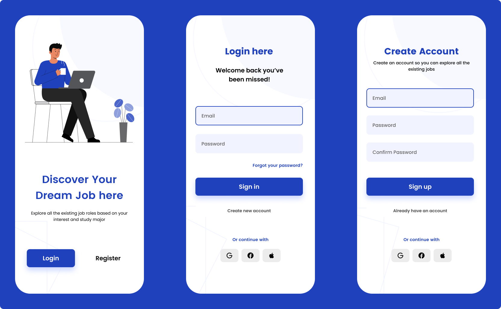

# 🚀 Flutter Login UI - 1

This is a simple login UI written in Flutter. I did this to learn more about Flutter and gain some experience with it.

## 📋 Table of Contents

- [📸 Screenshots](#-screenshots)
- [🏆 Acknowledgments](#-acknowledgments)

## 📸 Screenshots

## 🏆 Acknowledgments

### Special Thanks

- [Tugane Amiel](https://www.figma.com/@toonation) - For the Figma design

### Tools & Libraries Used

---

**[⬆ Back to Top](#-flutter-login-ui---1)**

Made with ❤️ by [Florian](https://github.com/Fedox-die-Ente)

---

generated using [better-repo](https://github.com/Fedox-die-Ente/better-repo)

